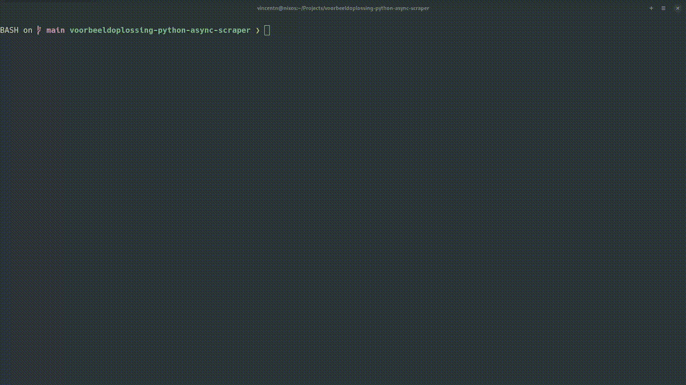

In dit project zal je een web scraper schrijven.
Dit is een programma dat webpagina's bezoekt om er informatie uit te halen.
Dit gebeurt door de links op een startpagina te verzamelen en deze te volgen, om vervolgens dat proces te herhalen. Dat aspect noemen we "crawlen". Het extraheren van nuttige data is dan het eigenlijke "scrapen".

Deze techniek wordt enorm veel gebruikt, voor onder andere:

- het trainen van zoekmachines
- het verzamelen van training data voor machine learning
- het opbouwen van site maps
- het controleren op vervallen URL's
- ...

Er bestaan gespecialiseerde tools voor zoals Scrapy, maar wij bouwen deze *from scratch*, omdat er heel veel interessante technieken in aan bod komen.

Het eindresultaat beschikt over een command line interface en kan zowel synchroon (één pagina na de andere bezoeken) als asynchroon (meerdere pagina's tegelijk bezoeken) werken. Hieronder zie je een demonstratie van het eindresultaat (per woord wordt het aantal voorkomens getoond en de "maximumdiepte" is het aantal niveaus dat je mag afdwalen van het startpunt):

